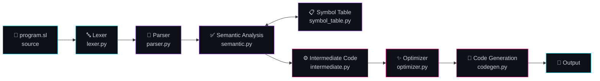

<div align="center">


<br/><br/>


<br/>


</div>

<div align="center">
  
</div>

## 🎯 &nbsp;What This Is

**SimpleLang** is a small programming language, and this repository is its
compiler — written entirely from scratch in Python, with **no parser generators,
no ANTLR, no PLY**. Every stage of the classic compiler pipeline is implemented
by hand.

It compiles `.sl` source files, supports variables, arithmetic, conditionals and
loops, and reports errors with useful messages instead of a stack trace.

> 📚 &nbsp;Built to understand how compilers actually work — the kind of thing you
> only really learn by writing every stage yourself.

<div align="center">
  
</div>

## 🔬 &nbsp;The Pipeline



| Stage | File | What it does |
|:------|:-----|:-------------|
| **Lexical Analysis** | `lexer.py` | Turns raw source text into a token stream |
| **Parsing** | `parser.py` | Builds an abstract syntax tree from the tokens |
| **Semantic Analysis** | `semantic.py` | Type checking, scope rules, undeclared-variable detection |
| **Symbol Table** | `symbol_table.py` | Tracks identifiers, types and scope across the program |
| **Intermediate Code** | `intermediate.py` | Emits a target-independent IR |
| **Optimization** | `optimizer.py` | Simplifies the IR before generation |
| **Code Generation** | `codegen.py` | Produces the final output code |

<div align="center">
  
</div>

## ✨ &nbsp;Features

<table>
<tr>
<td width="50%" valign="top">

### 🧩 &nbsp;Language Support
- Variables and assignment
- Arithmetic expressions with precedence
- Conditional statements (`if` / `else`)
- Loop constructs
- Error reporting with line context

</td>
<td width="50%" valign="top">

### 🛠️ &nbsp;Compiler Features
- Hand-written lexer and parser
- Symbol table with scope tracking
- Intermediate representation
- Optimization pass
- **GUI front end** (`gui.py`)

</td>
</tr>
</table>

<div align="center">
  
</div>

## ⚡ &nbsp;Quickstart

```bash
# Clone
git clone https://github.com/habib-u-rahman/SimpleLang-Compiler.git
cd SimpleLang-Compiler

# Compile a program from the CLI
python main.py program.sl

# Or launch the GUI
python gui.py
```

> ℹ️ &nbsp;Requires **Python 3.8+**. No external dependencies for the core compiler.

<div align="center">
  
</div>

## 🧪 &nbsp;Test Programs

The repo ships with sample `.sl` programs that exercise each language feature:

| File | Exercises |
|:-----|:----------|
| `program.sl` | General-purpose sample program |
| `test_math.sl` | Arithmetic and operator precedence |
| `test_if.sl` | Conditional branching |
| `test_loop.sl` | Loop constructs |
| `test_error.sl` | Error detection and reporting |

```bash
python main.py test_math.sl
python main.py test_if.sl
python main.py test_loop.sl
python main.py test_error.sl    # should report errors, not crash
```

<div align="center">
  
</div>

## 📁 &nbsp;Project Structure

```
SimpleLang-Compiler/
├── lexer.py            # tokenizer
├── parser.py           # AST builder
├── semantic.py         # type & scope checking
├── symbol_table.py     # identifier tracking
├── intermediate.py     # IR generation
├── optimizer.py        # IR optimization
├── codegen.py          # final code emission
├── main.py             # CLI entry point
├── gui.py              # graphical interface
└── *.sl                # sample programs
```

<div align="center">
  
</div>

## 🗺️ &nbsp;Roadmap

- [x] Lexical analysis
- [x] Parsing and AST construction
- [x] Semantic analysis with symbol table
- [x] Intermediate code generation
- [x] Optimization pass
- [x] Code generation
- [x] GUI front end
- [ ] Function definitions and calls
- [ ] More optimization passes (constant folding, dead code elimination)
- [ ] Formal language grammar documentation

<div align="center">

<br/>

<a href="https://github.com/habib-u-rahman">
  
</a>

<br/><br/>

<sub>⭐ <em>If this helped you understand compilers, a star means a lot.</em></sub>


</div>
